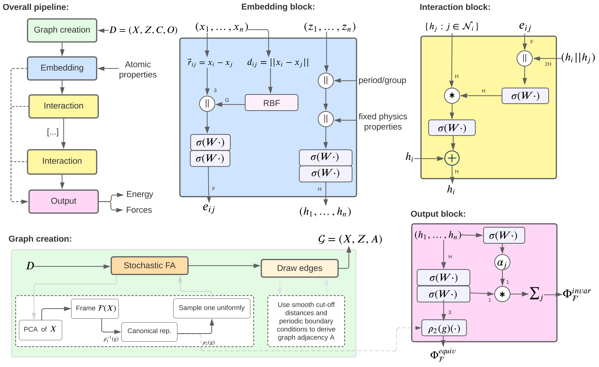

# FAENet: Frame Averaging Equivariant Network

FAENet is a graph neural network for crystal property prediction that achieves approximate SO(2)/SO(3) equivariance through frame averaging. It generates multiple reference and predictions from all frames are averaged, resulting in approximate equivariance without baking equivariance into the model itself.

## Overview

FAENet implements a graph neural network architecture with frame averaging to predict properties of crystal structures. The key innovation is using frame averaging to achieve approximate equivariance rather than building equivariance directly into the network architecture. Key features include:

- **Frame averaging techniques** (3D and 2D variants) to handle rotational symmetry
- **Approximate equivariance** through PCA-based frame transformations and prediction averaging
- **Flexible property prediction** for single or multiple target properties
- **Support for crystal slabs** with proper periodic boundary conditions
- **Efficient implementation** using PyTorch and PyG

## Pipeline Flow

1. **Data Loading**: Crystal structures are loaded from CSV files or structure files
2. **Graph Construction**: Structures are converted to graphs with proper periodic boundary conditions
3. **Frame Averaging**: Multiple reference frames are generated using PCA-based transformations
4. **Graph Neural Network**: Each frame is processed independently by the GNN
5. **Property Prediction**: Model outputs are averaged across frames to achieve approximate equivariance



## Setup

### Environment Setup

Create a new conda environment and install the required dependencies:

```bash
# Create conda environment
conda create -n faenet python=3.10
conda activate faenet

# Install PyTorch with CUDA support
conda install pytorch torchvision torchaudio pytorch-cuda=12.1 -c pytorch -c nvidia

# Install PyTorch Geometric and related packages
pip install torch-scatter torch-sparse torch-cluster torch-spline-conv -f https://data.pyg.org/whl/torch-2.5.1+cu121.html
pip install torch_geometric

# Install JARVIS toolkit for CGCNN features
pip install jarvis-tools>=2023.1.2

# Install other dependencies
pip install tyro pydantic pymatgen pandas tqdm structlog coolname
pip install sympy==1.13.1 fsspec ase mlflow
```

### Running Tests

To verify the installation, run the tests:

```bash
python -m pytest -v
```

To run a specific test:

```bash
python -m pytest tests/test_frame_averaging.py -v
```

## Configuration Parameters

FAENet uses a flat configuration model based on pydantic and tyro for type-safe and CLI-friendly configuration:

### Model Parameters

- `cutoff` (float, default=6.0): Cutoff distance for interactions
- `max_neighbors` (int, default=40): Maximum number of neighbors per atom
- `num_gaussians` (int, default=50): Number of Gaussians for distance expansion
- `hidden_channels` (int, default=128): Hidden channels in model
- `num_filters` (int, default=128): Number of filters in model
- `num_interactions` (int, default=4): Number of interaction blocks
- `dropout` (float, default=0.0): Dropout rate

### Training Parameters

- `batch_size` (int, default=32): Batch size
- `epochs` (int, default=100): Number of epochs
- `learning_rate` (float, default=0.001): Learning rate
- `weight_decay` (float, default=1e-5): Weight decay for optimizer
- `train_ratio` (float, default=0.8): Training set ratio
- `val_ratio` (float, default=0.1): Validation set ratio 
- `test_ratio` (float, default=0.1): Test set ratio
- `frame_averaging` (Optional[Literal["3D", "2D"]], default=None): Frame averaging dimension
- `fa_method` (str, default="all"): Frame averaging method ("all", "det", "random", "se3-all", "se3-det", "se3-random")
- `seed` (int, default=42): Random seed
- `num_workers` (int, default=0): Number of worker processes for data loading

### Data Parameters

- `data_path` (Path, default="./data"): Directory with data files or CSV file
- `structure_col` (Optional[str], default="slab"): Column name for structure data in CSV format
- `target_properties` (Literal["WF_top", "WF_bottom", "cleavage_energy", "WF"], default="WF"): Target property to predict
- `pbc` (bool, default=True): Use periodic boundary conditions

### General Parameters

- `output_dir` (Path, default="./outputs"): Output directory
- `device` (Literal["cuda", "cpu"], default="cuda"): Device to run on

## Running Training

FAENet provides a simple interface for training models using a dedicated training script.

### Basic Training (Single Property)

To train a model for a single property (e.g., WF_top):

```bash
python -m faenet.training_scripts.train_dft_data \
  --data_path=/path/to/data.csv \
  --target_properties=[WF_top] \
  --frame_averaging=3D
```

### Advanced Training (Multiple Properties with Custom Parameters)

For more advanced usage with multiple properties and customized parameters:

```bash
python -m faenet.training_scripts.train_dft_data \
  --data_path=/path/to/data.csv \
  --structure_col=slab \
  --target_properties=[WF_top,WF_bottom,cleavage_energy] \
  --frame_averaging=3D \
  --fa_method=all \
  --batch_size=64 \
  --epochs=300 \
  --learning_rate=0.0005 \
  --hidden_channels=256 \
  --num_interactions=6 \
  --dropout=0.1 \
  --output_dir=/path/to/outputs \
  --device=cuda
```

## Enhanced Features: CGCNN Integration

FAENet uses CGCNN (Crystal Graph Convolutional Neural Network) features from the JARVIS toolkit, providing rich atomic property information for improved prediction performance.

### Feature Information

CGCNN features replace the simple one-hot encoding with a 92-dimensional vector containing rich physicochemical information for each atom:

- Atomic properties (electronegativity, radius, electron affinity, etc.)
- Group and period information
- Valence electron configuration
- And many other chemical descriptors

These features provide the model with improved chemical understanding, leading to:
- Faster convergence during training
- Better generalization to new materials
- Improved prediction accuracy for complex properties

### Using CGCNN Features

The implementation is transparent to users - no additional configuration is needed. The features are automatically used when processing structures through the FAENet pipeline.

**Example usage remains the same**:
```python
from faenet.train import train_faenet

# Train model with CGCNN features (automatically used)
model, metrics = train_faenet(
    data_path="./data/structures.csv",
    structure_col="structure",
    target_properties=["formation_energy"],
    frame_averaging="3D"
)
```

### Compatibility Notes

- **Models**: Previous models trained with one-hot encoding are not compatible with the new CGCNN features. You'll need to retrain models.
- **Frame Averaging**: CGCNN features are fully compatible with all frame averaging methods.
- **Performance**: You may notice increased memory usage but faster convergence during training.

## License

This project contains code based on other projects, which are licensed as follows:
- Parts adapted from CGCNN: See [LICENSE.cgcnn](FAENET/licenses/LICENSE.cgcnn)
- Parts adapted from MMF: See [LICENSE.mmf](FAENET/licenses/LICENSE.mmf)
- CGCNN features adapted from JARVIS toolkit

For the overall project license, see [LICENSE.md](LICENSE.md).